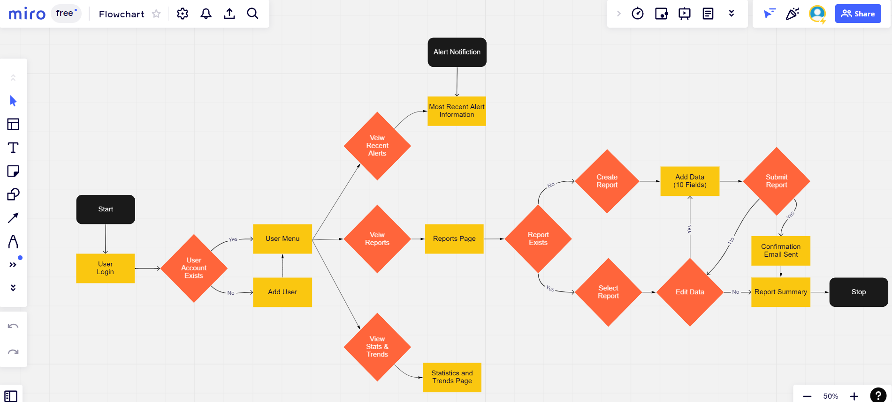

# LPRC-UX-Project
Internship project for developing an interactive prototype of a web app that allows retail stores to report crime incidents.

Summary: Participated in User Experience focus groups to generate ideas for user needs and product features. Utilized Affinity Diagrams for creating and organizing product features into functionalities. Created personas to capture user characteristics and illustrated various user scenarios with narrative storyboard illustrations.

Outcome was an interactive prototype:

Interactive Prototype Link: https://www.figma.com/proto/YydFmOKgVVJprtSkqGplA8/LPRC-Prototype?node-id=2%3A2&scaling=scale-down&page-id=0%3A1&starting-point-node-id=2%3A2

Taskflow chart:

